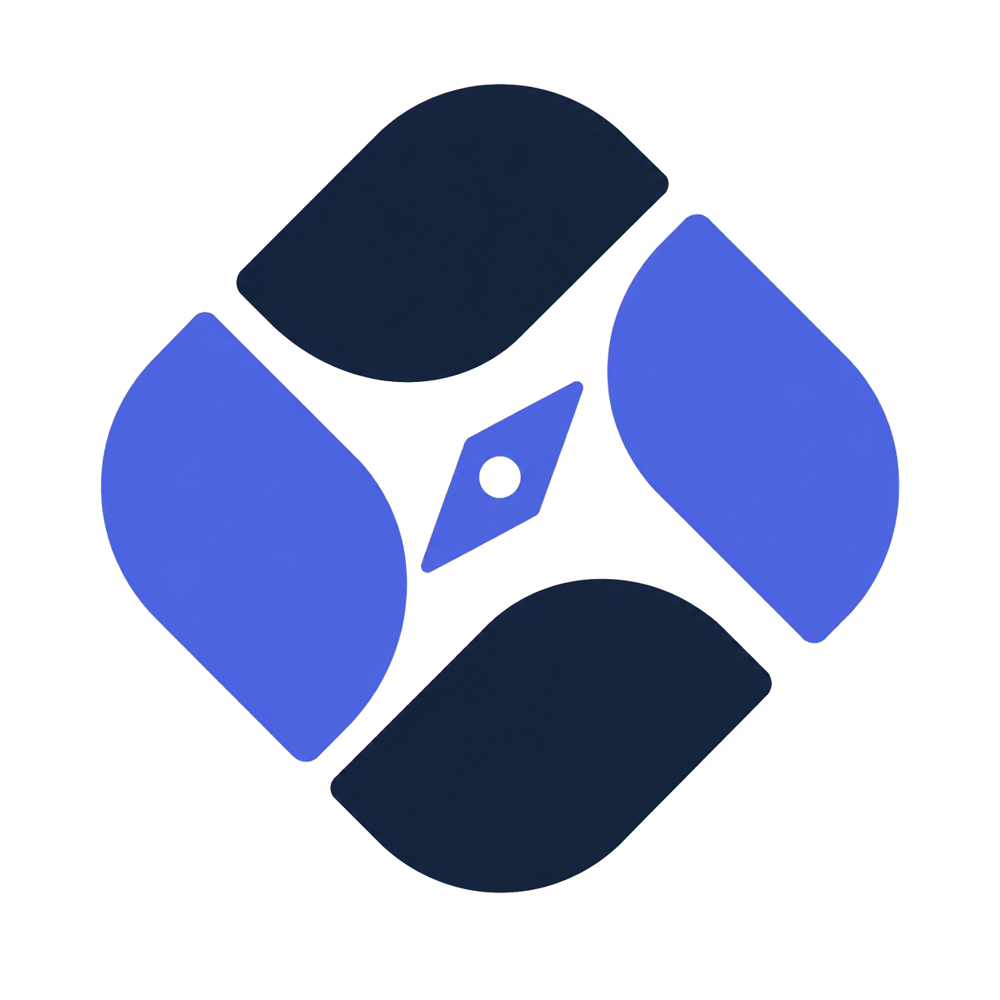
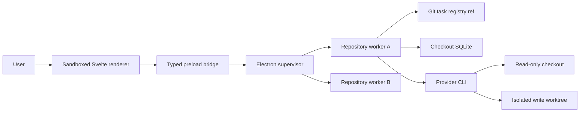

<div align="center">
  <picture>
    <source media="(prefers-color-scheme: dark)" srcset="apps/ui/static/assets/phaseatlas-logo-mark-dark.png">
    <source media="(prefers-color-scheme: light)" srcset="apps/ui/static/assets/phaseatlas-logo-mark.png">
    
  </picture>

  # PhaseAtlas

  **A local-first desktop control plane for planning, running, and reviewing AI-assisted repository work.**

  Turn a request into reviewable tasks, understand their dependencies on a map, and run coding agents
  in isolated worktrees without handing control of your repository to a hosted orchestration service.
</div>

> [!IMPORTANT]
> PhaseAtlas is pre-1.0 software. The maintained development and packaging target is currently macOS,
> and contracts may evolve while the first public release is prepared.

Read the [changelog](CHANGELOG.md), [roadmap](docs/roadmap.md), or
[production release guide](docs/releasing.md).

<p align="center">
  Developed and maintained by <a href="https://ketviet.vn"><strong>KétViệt</strong></a>.
</p>

## Why PhaseAtlas?

Coding agents are effective at individual prompts, but real repository work is larger than a chat
session. Teams still need to decide what should be done, review the scope, understand dependencies,
control write access, recover interrupted runs, and preserve evidence after the model process exits.

PhaseAtlas makes that workflow explicit:

1. **Plan** a repository or an existing workspace with an installed model CLI.
2. **Review and publish** structured task outlines before they become canonical repository data.
3. **Initialize detail on demand** for one task or a parallel batch, so planning does not spend tokens
   on content nobody needs yet.
4. **Navigate the work** as a dense list or a dependency map with clear ready, active, blocked, and
   completed states.
5. **Run agents safely** through read-only analysis, planning, implementation in isolated worktrees,
   and review.
6. **Inspect durable results** after a reload or restart without rendering an unbounded command log.

The repository remains the authority. Agents may propose tasks, write in an isolated checkout, and
produce evidence; they cannot silently publish contracts or declare canonical work complete.

## Features

### Repository and workspace control

- Open multiple Git repositories in one desktop application.
- Run one isolated repository worker per active checkout.
- Organize dozens of logical workspaces inside each repository.
- Watch `.phaseatlas/` and refresh task projections when canonical files change.
- Persist the repository catalog and checkout identity across desktop restarts.

### Structured planning

- Plan a new workspace or add tasks to an existing workspace from natural language.
- Use provider-discovered models instead of free-form model names.
- Review, edit, validate, and publish proposals explicitly.
- Publish lightweight outlines first, then initialize detailed Markdown bodies individually or in
  batches of up to four concurrent model calls.
- Keep generated content editable through the embedded checkout-bound Theia IDE.

### Task workbench

- Switch between compact list and dependency-map views.
- Visualize task readiness, active work, blockers, and completion.
- Open rendered Markdown task bodies from either view.
- Render Mermaid diagrams inside task documentation.
- Edit repository files in the embedded Theia IDE, with its explorer, terminals, language services,
  and extension support.

### Durable agent execution

- Run `analyze`, `plan`, `implement`, and `review` actions through a provider-neutral contract.
- Derive permissions from the task and action instead of accepting arbitrary commands from the UI.
- Execute write-capable work in a unique PhaseAtlas-owned Git worktree.
- Stream normalized agent narration, tool activity, file changes, and lifecycle events.
- Persist run specifications, events, results, retries, and final lifecycle state in checkout-owned SQLite.
- Fetch command output in bounded pages only when a user opens a command; collapsed output is not kept
  in the renderer DOM.
- Recover interrupted attempts explicitly and reject stale results after a canonical task changes.

### Theia AI chat

- Open Theia's native AI Chat in the selected repository with `Option+L` on macOS (`Alt+L` elsewhere).
- Use the registered `Codex` or `ClaudeCode` agent without a parallel PhaseAtlas chat window.
- Reuse local Codex/ChatGPT and Claude Code authentication instead of requiring provider API keys in
  the renderer.
- Keep the repository's agent, model, and reasoning effort synchronized in both directions with the
  PhaseAtlas bar above Theia's chat input; unsupported values are rejected against the live repo catalog.
- Keep context attachment, modes, confirmations, and chat history inside Theia.

### Provider support

PhaseAtlas currently includes adapters for:

| Provider | Planning | Task content | Execution | Chat | Isolated chat edit |
| --- | :---: | :---: | :---: | :---: | :---: |
| Codex CLI | Yes | Yes | Yes | Yes | Yes |
| Claude Code | Yes | Yes | Yes | Yes | Yes |

Provider credentials and authentication remain owned by the installed CLI. PhaseAtlas receives a
bounded capability and model projection; it does not expose executable paths, raw provider payloads,
or credentials to the renderer.

## Requirements

- macOS for the currently verified desktop workflow
- Git
- Node.js `24.14.0` or a newer Node 24 release
- pnpm `11.9.0` (pinned by the root `packageManager` field)
- At least one installed and authenticated provider CLI for AI-assisted actions:
  - Codex CLI, or the Codex binary bundled with the macOS ChatGPT application
  - Claude Code

You can browse canonical repositories and edit files without a provider. Planning, AI chat, task-content
initialization, and agent runs require an available CLI with a discoverable model catalog.

## Quick start

Clone the repository and select the pinned runtime:

```bash
git clone https://github.com/ketvietlab/phaseatlas.git
cd phaseatlas
nvm use
```

Install dependencies and start the desktop development environment:

```bash
pnpm install
pnpm dev
```

`pnpm dev` performs the following automatically:

1. builds the shared contracts, core, repository worker, and Electron runtime;
2. starts the Svelte renderer at `http://127.0.0.1:4177`;
3. launches Electron; and
4. hot-reloads renderer changes or rebuilds and restarts Electron when backend sources change.

Only one PhaseAtlas development session can own port `4177`. Stop the existing session before starting
another one.

## First run

1. Start PhaseAtlas and choose **Open repository**.
2. Select a Git checkout. PhaseAtlas grants one worker access to that fixed checkout root.
3. Choose an available CLI and one of the models discovered from that provider.
4. If the repository is not configured, use **Plan workspace** to propose the first workspace and
   starter tasks.
5. Review the proposal, publish it, and initialize detailed task content only where it is useful.
6. Open a task from List or Map view to read its Markdown body, edit it, or start an allowed run.

PhaseAtlas stores the repository identity in every code branch and canonical planning data on the
configured task registry ref:

```text
.phaseatlas/
└── repository.yaml  # points to refs/heads/phaseatlas/tasks

phaseatlas/tasks:.phaseatlas/
└── workspaces/
    └── <workspace-slug>/
        ├── workspace.yaml
        ├── coverage-events/
        │   └── <uuid>.yaml
        └── tasks/
            ├── <task-id>.yaml
            └── <task-id>.md
```

YAML owns the task contract and dependency graph. The optional Markdown sidecar owns the detailed task
body. Both are normal Git-tracked files. PhaseAtlas opens the registry as a separate Theia target;
saving creates a draft and **Review & Publish** validates, commits, and pushes it without switching the
code checkout away from `develop` or a feature branch.

Documentation coverage is derived from tracked `docs/` files plus immutable, uniquely named coverage
events. Concurrent audits append different paths and are automatically rebased with an expected-head
lease, so they never rewrite a shared `coverage.yaml`. A changed document becomes pending by hash;
different audit conclusions become an explicit PhaseAtlas projection conflict.

See the [task contract](docs/contracts/task-contract.md) and
[planning contract](docs/contracts/planning-contract.md), plus the
[coverage contract](docs/contracts/coverage-contract.md), before generating these files by hand.

## How it works



The renderer is treated as an untrusted web surface. It cannot import Node.js, start arbitrary
commands, or choose working directories. Electron supervises application lifecycle and routes typed
messages, while repository parsing and agent execution stay inside the checkout-bound worker.

Workspaces are logical partitions, not extra processes. Opening two repositories creates two workers;
opening ten workspaces in one repository still uses that repository's single worker.

For a deeper tour, read the [architecture overview](docs/architecture/overview.md),
[repository process model](docs/architecture/repository-process-model.md), and architectural decision
records under [`docs/decisions`](docs/decisions).

## Data ownership and security model

PhaseAtlas separates durable repository truth from local operational state:

| Data | Owner | Typical contents |
| --- | --- | --- |
| Canonical contracts | Git-tracked `.phaseatlas/` | repository, workspace, task, policy, promoted evidence |
| Operational state | Application-support SQLite | runs, chat sessions, events, retries, leases, caches |
| Provider authentication | Provider CLI or operating system | credentials, login sessions, private provider state |
| UI preference | Local desktop storage | selected views and repository-scoped presentation choices |

Important boundaries:

- model output is untrusted until it passes shared validation;
- renderer requests use repository, workspace, task, run, and session identifiers—not arbitrary paths
  or process IDs;
- implementation runs write only inside leased worktrees with task-derived scope;
- Git independently derives changed files before a result can be reviewed;
- an agent's proposed task state is advisory and never updates canonical YAML automatically; and
- cancellation, retry, interruption, and final-state ordering are persisted rather than inferred from UI
  state.

Read [ADR 0002](docs/decisions/0002-storage-boundaries.md) and the
[agent run contract](docs/contracts/agent-run-contract.md) for the complete authority model.

## Development

### Common commands

```bash
pnpm dev              # start Vite and Electron with runtime rebuilds
pnpm check            # TypeScript and Svelte validation
pnpm test             # core and repository-worker tests
pnpm build            # production build for every workspace package
pnpm package:desktop  # create an ad-hoc-signed macOS development bundle
pnpm verify:desktop   # verify bundle layout, manifest, signature, renderer, and worker
pnpm release:validate # validate package version and CHANGELOG.md
```

Run the main verification suite before submitting a change:

```bash
pnpm check
pnpm test
pnpm build
```

### Repository layout

```text
apps/desktop             Electron main process and narrow preload bridge
apps/repository-worker   Checkout-bound repository backend and provider adapters
apps/ui                  Svelte 5 renderer and desktop workbench
packages/contracts       Shared IPC, domain types, and model-output JSON schemas
packages/core            Validation, persistence, Git inspection, and execution core
scripts                  Development, packaging, and bundle-verification tooling
docs/architecture        Runtime and editor architecture
docs/contracts           Canonical planning, task, run, chat, and edit contracts
docs/decisions           Architectural decision records
.phaseatlas              PhaseAtlas's own workspaces and canonical task registry
```

### Architectural rules for contributors

- Keep Node.js and Electron imports out of the renderer.
- Add shared request, response, and event types to `packages/contracts` before wiring IPC.
- Keep repository parsing and provider execution out of the Electron main process.
- Bind every repository worker to one canonical checkout root at startup.
- Keep one canonical task per YAML file to reduce merge conflicts.
- Update the corresponding contract or ADR when changing a trust or authority boundary.
- Prefer fail-closed behavior for missing, invalid, stale, or ambiguous repository state.

The complete local workflow is documented in the [development guide](docs/development.md).

## Building and releasing the macOS application

Create and verify a development artifact:

```bash
pnpm package:desktop
pnpm verify:desktop
```

The output is written beneath:

```text
artifacts/desktop/darwin-<architecture>/
├── PhaseAtlas.app
└── PhaseAtlas-<version>-darwin-<architecture>.zip
```

Development artifacts are ad-hoc signed and have updates disabled. GitHub releases temporarily use
the same ad-hoc signature while Developer ID distribution is deferred. Users must explicitly allow
the downloaded application or remove its quarantine attribute before first launch. Private keys and
provider credentials are never copied into the application bundle.

See [Desktop distribution](docs/development.md#desktop-distribution) for release inputs, evidence,
installation, update, and rollback procedures.

Production releases use Semantic Versioning and Keep a Changelog. The root `package.json` is the
application version authority, the Git tag must be exactly `v<version>`, and the matching changelog
section becomes the GitHub Release notes. A tag on `main` starts `.github/workflows/release.yml`, which
validates the repository, builds ad-hoc-signed Apple Silicon and Intel artifacts, generates SHA-256
checksums, and uploads the complete set to GitHub Releases.

Maintainers must configure the `production` environment before creating a release tag. Apple signing,
notarization, and signed update metadata remain available as a future fail-closed release mode. The
complete version policy, quarantine instructions, tag procedure, pipeline, and recovery process are in
the [production release guide](docs/releasing.md).

## Project status and roadmap

PhaseAtlas is currently at version `0.1.0`. The core desktop boundary, canonical task registry,
provider-neutral planning, task-content initialization, dependency workbench, embedded Theia IDE and
AI Chat, durable agent execution, task conversation editing, and macOS packaging path are present.

Pre-1.0 priorities include hardening source adapters, promotion workflows, provider compatibility,
cross-platform support, release hardening, and documentation. Track milestone status in the
[project roadmap](docs/roadmap.md). The roadmap is directional; contracts and tests are the source of
truth for implemented behavior.

User-visible changes are maintained in [CHANGELOG.md](CHANGELOG.md).

## Contributing

Contributions are welcome while the public contribution policy is being finalized.

1. Open an issue or discussion for a large behavioral or architectural change.
2. Create a focused branch from `develop`.
3. Keep changes inside the documented process, storage, and trust boundaries.
4. Add or update tests and contract documentation where behavior changes.
5. Add user-visible changes to the `Unreleased` section of `CHANGELOG.md`.
6. Run `pnpm check`, `pnpm test`, and `pnpm build`.
7. Open a pull request into `develop` with the motivation, user impact, and verification results.

Please do not include repository secrets, provider credentials, private model payloads, generated
application-support databases, or unrelated `.phaseatlas/` task-state edits in a pull request.

A dedicated `CONTRIBUTING.md`, code of conduct, and security policy have not yet been published. For a
security-sensitive report, avoid a public issue and contact the maintainers privately through GitHub.

## License

PhaseAtlas is released under the [MIT License](LICENSE). You may use, copy, modify, merge, publish,
distribute, sublicense, and sell copies, including for commercial purposes, provided the copyright and
license notice remain with copies or substantial portions of the software.

## Developer

<div align="center">
  <a href="https://ketviet.vn" aria-label="Visit KétViệt">
    <picture>
      <source media="(prefers-color-scheme: dark)" srcset="apps/ui/static/assets/ketviet-logo-dark.png">
      <source media="(prefers-color-scheme: light)" srcset="apps/ui/static/assets/ketviet-logo-light.png">
      
    </picture>
  </a>

  <p>PhaseAtlas is developed and maintained by <a href="https://ketviet.vn"><strong>KétViệt</strong></a>.</p>
</div>

---

<div align="center">
  Built for repository work that needs more structure than a chat transcript and more control than an
  unattended agent loop.
</div>
