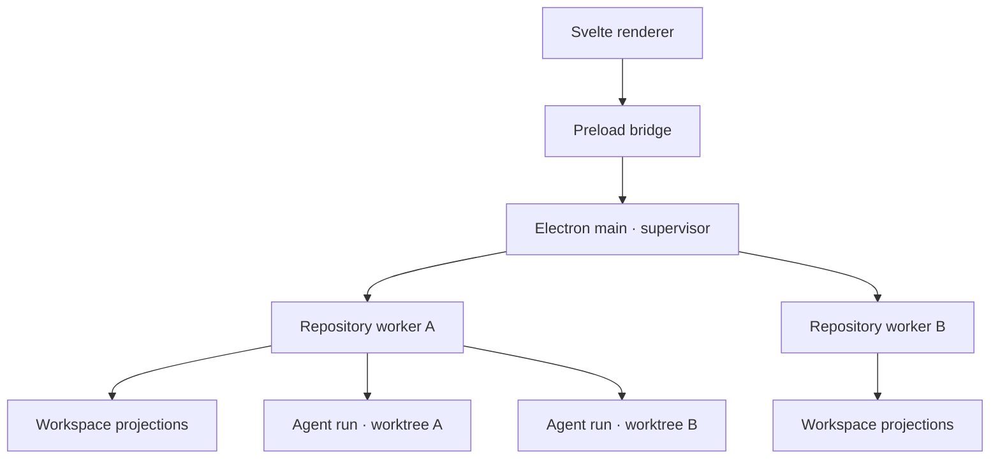

# Architecture overview

## Purpose

PhaseAtlas is a local-first desktop application for inspecting repository work, generating structured
task proposals, and running coding agents inside isolated worktrees. The repository remains the
authority for task contracts and promoted evidence; desktop storage owns volatile execution state.

## Runtime map



### Renderer

The renderer is treated as an untrusted web surface. It owns presentation and transient interaction
state. It cannot import Node.js, read arbitrary paths, or start commands.

### Preload bridge

The preload script exposes a narrow `window.phaseatlas` API. It maps typed operations to Electron IPC
without exposing `ipcRenderer` itself.

### Main process

The main process owns application lifecycle, native dialogs, repository selection, worker supervision,
and message routing. Domain parsing and agent execution do not run in the main event loop.

### Repository worker

Every active checkout receives one Electron utility process. Its repository root is fixed at process
startup. The worker owns repository inspection, workspace projections, file watching, task snapshots,
planning-run scheduling, and provider CLI child processes.

Workspaces are logical partitions inside a repository worker; they do not receive separate processes.

## Trust boundaries

```text
Renderer                     Untrusted input and rendered repository content
Preload                      Explicit, typed capability boundary
Electron main                Trusted supervisor; no domain-heavy work
Repository worker            Trusted for exactly one granted checkout
Agent subprocess/worktree    Sandboxed execution with task-scoped permissions
```

Planning runners are provider-specific only behind the repository-worker adapter boundary. The
renderer discovers capabilities and receives normalized events; it never receives credentials,
executable paths, raw process handles, or permission flags.

The renderer sends repository IDs and task IDs, never arbitrary working directories or executable
commands. The worker resolves all paths under its granted root and validates task policy before a run.

## Source versus projection

PhaseAtlas distinguishes four data classes:

1. **Canonical task contract** — Git-tracked `.phaseatlas/` YAML.
2. **Repository evidence** — Git, pull requests, CI, and promoted evidence documents.
3. **Operational state** — local SQLite, run events, logs, retries, and UI state.
4. **Projection** — workspace metrics and display status derived from the previous sources.

An agent can propose state and produce evidence. It cannot directly declare a canonical task complete.
