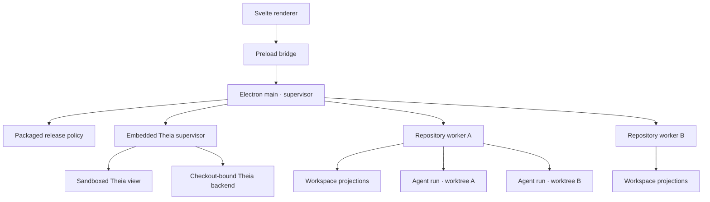

# Architecture overview

## Purpose

PhaseAtlas is a local-first desktop application for inspecting repository work, generating structured
task proposals, and running coding agents inside isolated worktrees. The repository remains the
authority for task contracts and promoted evidence; desktop storage owns volatile execution state.

## Runtime map



### Renderer

The renderer is treated as an untrusted web surface. It owns presentation and transient interaction
state. It cannot import Node.js, read arbitrary paths, or start commands.

### Preload bridge

The preload script exposes a narrow `window.phaseatlas` API. It maps typed operations to Electron IPC
without exposing `ipcRenderer` itself.

### Main process

The main process owns application lifecycle, native dialogs, repository selection, worker supervision,
and message routing. Domain parsing and agent execution do not run in the main event loop.

In a packaged application, the main process reads a fail-closed release policy from the application
resources, loads only the bundled static renderer, and resolves the repository-worker entry inside the
same bundle. Development artifacts disable updates. Release artifacts permit only a manually initiated
flow backed by pre-verified signed metadata; no renderer capability can change that policy.

The main process also supervises embedded Theia instances. The renderer may select only a registered
checkout ID, retained run ID, or configured task-registry target; trusted code resolves that identity
to the canonical checkout, retained worktree, or application-managed registry worktree before
starting the backend. The Theia browser surface is separately sandboxed, and its backend is bound to
loopback for exactly one resolved workspace.

### Repository worker

Every active checkout receives one Electron utility process. Its repository root is fixed at process
startup. The worker owns repository inspection, workspace projections, file watching, task snapshots,
planning-run scheduling, and provider CLI child processes.

Workspaces are logical partitions inside a repository worker; they do not receive separate processes.

## Trust boundaries

```text
Renderer                     Untrusted input and rendered repository content
Preload                      Explicit, typed capability boundary
Electron main                Trusted supervisor; no domain-heavy work
Theia browser surface        Sandboxed web surface; no PhaseAtlas filesystem or IPC bridge
Theia backend/extensions     Trusted local IDE authority for exactly one resolved workspace
Repository worker            Trusted for exactly one granted checkout
Agent subprocess/worktree    Sandboxed execution with task-scoped permissions
Release tooling              External signing/notarization credentials; public metadata only in bundle
```

Planning runners are provider-specific only behind the repository-worker adapter boundary. The
renderer discovers capabilities and receives normalized events; it never receives credentials,
executable paths, raw process handles, or permission flags.

The renderer sends repository IDs and task IDs, never arbitrary working directories or executable
commands. The worker resolves all paths under its granted root and validates task policy before a run.

## Source versus projection

PhaseAtlas distinguishes four data classes:

1. **Canonical task contract** — Git-tracked `.phaseatlas/` YAML on the repository's configured task
   registry ref; an unconfigured repository reads it from the current code checkout for compatibility.
2. **Repository evidence** — Git, pull requests, CI, and promoted evidence documents.
3. **Operational state** — local SQLite, run events, logs, retries, and UI state.
4. **Projection** — workspace metrics and display status derived from the previous sources.

A repository without `.phaseatlas/repository.yaml` may additionally expose a read-only legacy
candidate projection from the fixed, approved document allowlist. That projection is isolated from
canonical task snapshots, revisions, dependency graphs, execution, and completion. A configured
repository never combines canonical YAML with legacy candidates, and an invalid manifest never
activates the legacy path.

An agent can propose state and produce evidence. It cannot directly declare a canonical task complete.

## Distribution boundary

The macOS bundle contains Electron, the desktop main/preload output, the static renderer, the bundled
repository worker, and the embedded Theia runtime with its pinned extensions and terminal support.
A generated SHA-256 manifest covers all PhaseAtlas-owned runtime files, including Theia and its default
extensions. Packaging validates the renderer sandbox strings, typed preload exposure, absence of
workspace imports, absence of credential-like custom files, and the application code signature before
the smoke test can start it.

The application bundle is replaceable; canonical tasks remain on each repository's task registry ref
and checkout-owned operational SQLite remains under PhaseAtlas application support. This separation
makes rollback an application replacement rather than a task or execution-state migration.
