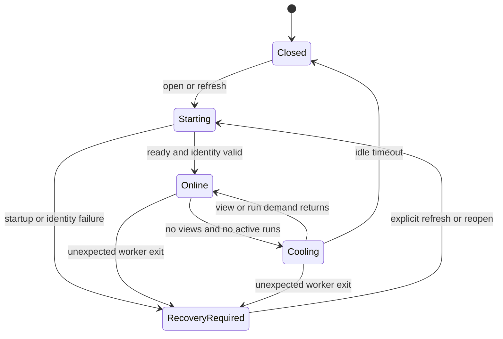

# Repository process model

## Identity and ownership

One canonical checkout path maps to one checkout ID, one live repository worker, and one operational
database writer:

```text
canonical checkout path -> checkoutId -> utility process -> operations.sqlite
```

The stable `repositoryId` comes from `.phaseatlas/repository.yaml`. Clones and worktrees can therefore
share a repository ID while their path-derived checkout IDs, workers, and operational histories remain
isolated. The main process validates a replacement worker's repository ID, checkout ID, and canonical
path against the catalog before clearing recovery state.

The catalog records known checkouts independently of the live-worker registry. Closing or idling a
worker never removes its catalog entry or checkout history.

Canonical task identity is separate from code-checkout identity:

```text
repositoryId + configured task ref -> detached registry worktree -> TaskSnapshot
checkout path + HEAD                  -> execution context       -> operations.sqlite
```

Every checkout for the same configured repository reads the same remote registry ref. The worker
uses a private detached worktree, so changing the branch in the user checkout cannot change project
task state. Dirty registry files are drafts; refresh will not replace them, and publish uses the
expected registry commit as a force-with-lease guard.

## Demand and lifecycle

The supervisor tracks two independent sources of worker demand:

- each renderer view currently using a checkout;
- each planning or task-content run whose latest status is `starting` or `running`.

The worker stays online while either set is non-empty. When both become empty, the checkout enters
`cooling` and starts the configurable idle timer (`PHASEATLAS_WORKER_IDLE_MS`, 30 seconds by default).
New demand cancels that timer. The timer stops the worker only after checking both sets again.



Concurrent starts are coalesced by checkout ID, so refreshes racing after idle shutdown or failure
share one replacement worker. Expected idle/application shutdown and unexpected exit are distinct:
an expected stop leaves the checkout `closed`; an unexpected exit rejects pending calls, removes only
that worker generation, and marks the catalog entry `recovery_required`.

Normal repository calls fail while recovery is required. Refreshing or reopening is the explicit
recovery action. The replacement reuses the checkout store, reconciles unfinished runs once, reports
ready, and must pass identity validation before the catalog returns to `online`.

## Durable run stream

Planning and task-content runs are registered before execution begins. Every normalized event is
committed to the checkout store before it is forwarded to Electron. Sequence allocation and insertion
share one SQLite transaction, producing a unique, strictly increasing sequence for each run even after
the database is reopened.

At worker startup, any persisted `starting` or `running` run receives one `run.interrupted` event with
the next sequence and becomes `interrupted`. Repeating startup reconciliation does not append another
interruption. Persisted events are operational history only; they cannot change canonical task state,
promote evidence, or complete a task.

## Worker protocol

Requests and responses are correlated with `requestId`:

```json
{"requestId":"...","method":"run.events","params":{"runId":"...","afterSequence":12}}
{"requestId":"...","result":[]}
```

Unsolicited events omit `requestId`:

```json
{"type":"repository.changed","payload":{"paths":[".phaseatlas/workspaces/core/workspace.yaml"]}}
```

The provider-neutral protocol includes repository, workspace, task, coverage, file, runner,
planning, task-content, and persisted-run operations. Coverage writes are validated append-only
events published to the configured task registry with an expected-head lease. Raw child processes,
executable paths, credentials, and provider protocol payloads do not cross the renderer bridge.

## Change notifications

The worker watches `.phaseatlas/` in the configured registry worktree (or the checkout for legacy v1
repositories) with a cross-platform file watcher. Changes are debounced, cached
repository projections are invalidated, and a typed `repository.changed` event is forwarded through
Electron main and preload. The renderer requests fresh projections; it never reads the repository or
operational databases directly.

## Execution concurrency

Read-only runs share the fixed canonical checkout but must use an executor that enforces `read-only`.
Write-capable implementation runs never execute there. They receive an exclusive checkout-owned
worktree lease whose branch and directory are allocated by trusted backend code.

```text
agent run -> durable allocating lease -> unique Git worktree -> active lease
          -> execute/inspect -> exact validated cleanup -> released lease
```

Lease allocation is serialized within the worker, so concurrent requests cannot share an ID, branch,
or directory. Lease lifecycle events use the checkout operational stream established for run history.
After a worker restart, previously allocating, active, or releasing leases become `abandoned`; their worktrees stay
in place and are reported for recovery rather than deleted or reused.

The scheduler independently inspects Git changes in the leased worktree and attaches scope violations
to the advisory result. Neither an executor result nor lease cleanup can modify canonical task state.
