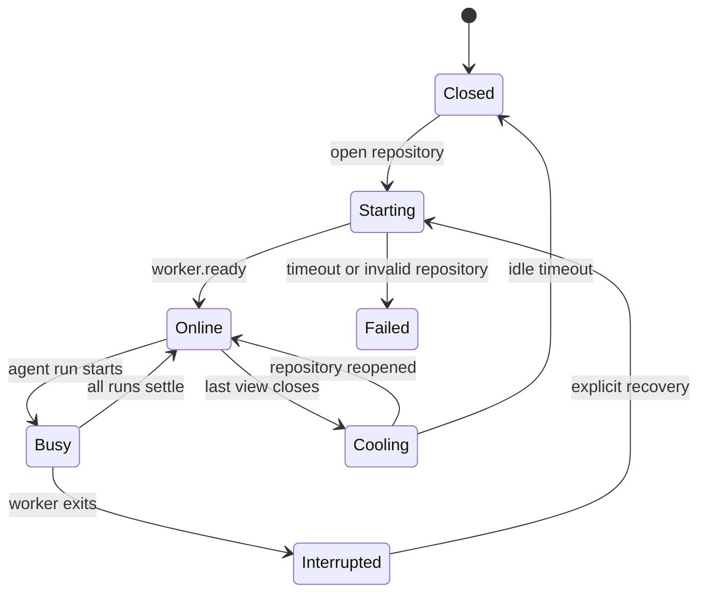

# Repository process model

## Invariant

An active checkout maps to one repository worker process:

```text
checkoutId -> utility process -> fixed canonical repository path
```

The stable `repositoryId` comes from `.phaseatlas/repository.yaml`. The local `checkoutId` is derived
from the canonical filesystem path, allowing multiple clones or worktrees of the same repository to
remain isolated on one machine.

## Lifecycle



The scaffold currently starts lazily and stops explicitly. Idle TTL, run-aware shutdown, and crash
recovery are planned after persistence lands.

## Worker protocol

Requests and responses are correlated with `requestId`:

```json
{"requestId":"...","method":"workspace.list"}
{"requestId":"...","result":[]}
```

Unsolicited events omit `requestId`:

```json
{"type":"repository.changed","payload":{"paths":[".phaseatlas/workspaces/core/workspace.yaml"]}}
```

The initial protocol exposes:

- `repository.describe`
- `repository.refresh`
- `workspace.list`
- `task.snapshot`

Agent run methods will be added only after task and run schemas are validated at runtime.

## Change notifications

The worker watches `.phaseatlas/` with a cross-platform file watcher. Changes are debounced, cached
repository projections are invalidated, and a typed `repository.changed` event is forwarded through
Electron main and preload. The renderer responds by requesting fresh repository, workspace, and task
snapshots; it never reads source files directly.

## Concurrency

Read-only runs may share a repository checkout. Every write run must receive a unique worktree lease.
Two runs must never write to the same worktree. Concurrency is limited at both repository and
application level.
